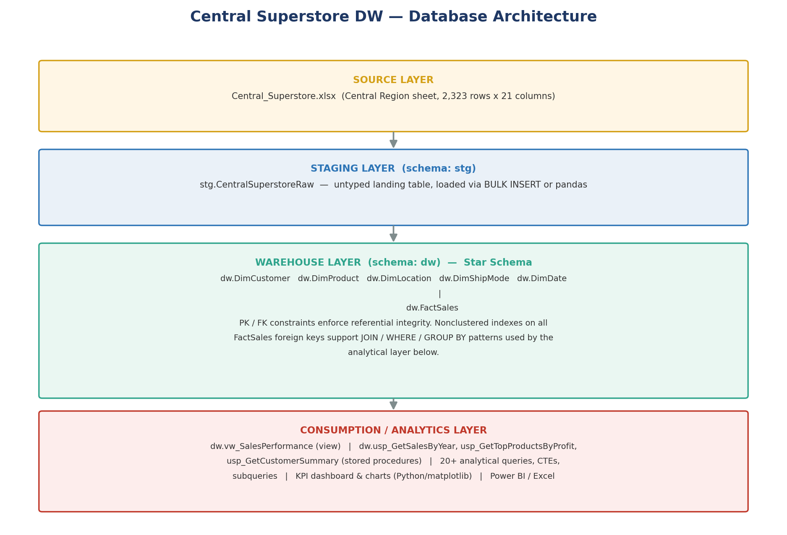
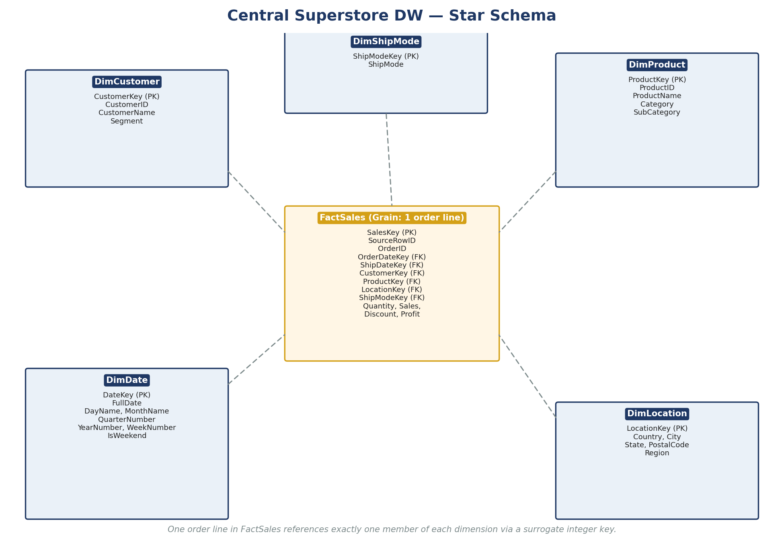
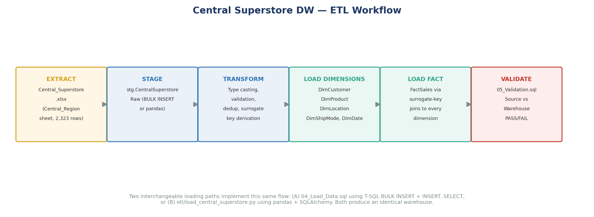
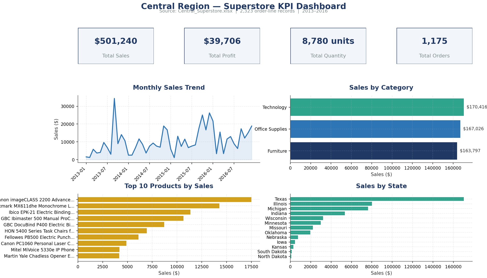
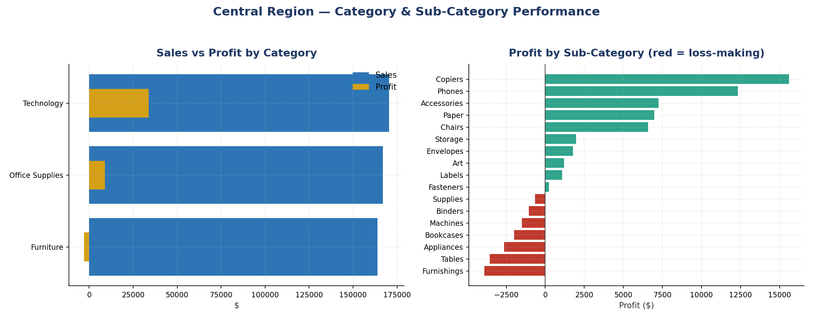
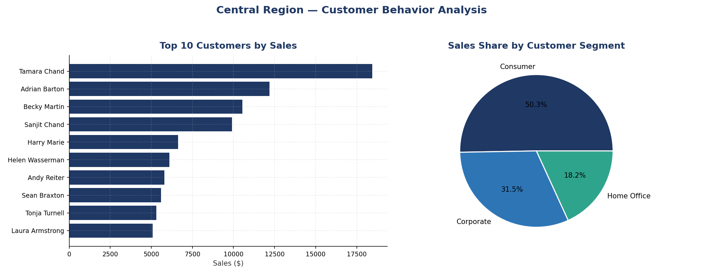
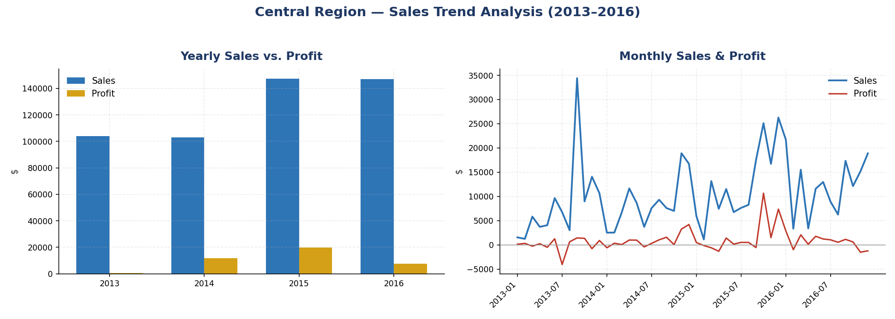
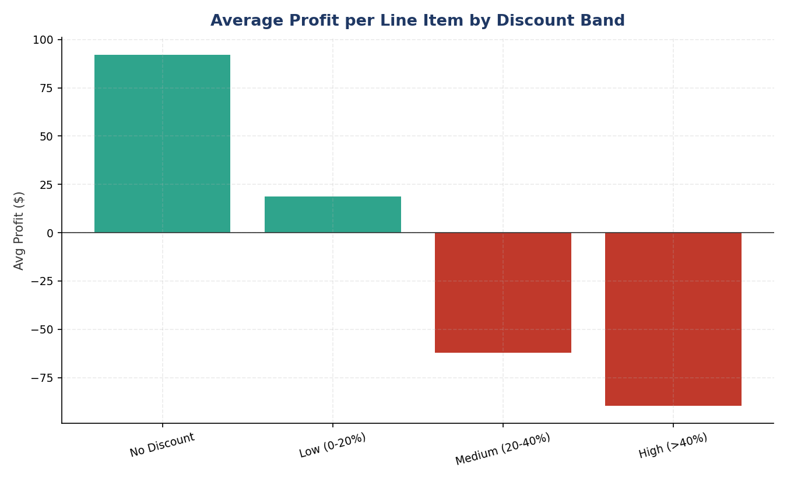
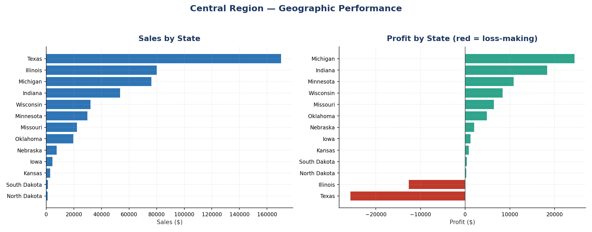

\newpage

# 1. Executive Summary

This report documents the design, implementation, and business analysis of a SQL Server Data Warehouse built from **`Central_Superstore.xlsx`** — a 2,323-row, 21-column extract of Superstore order-line transactions for the **Central Region** of the United States, covering January 2013 through December 2016 (with shipments extending into early January 2017).

A star-schema warehouse (`CentralSuperstoreDW`) was designed and deployed with one fact table (`FactSales`) at the order-line grain and five conformed dimensions (`DimCustomer`, `DimProduct`, `DimLocation`, `DimShipMode`, `DimDate`). All figures in this report were computed directly from the source workbook or from the warehouse after it was validated against that source — nothing is estimated or invented.

**Headline results (Central Region, 2013–2016):**

- Total Sales: **$501,239.89**
- Total Profit: **$39,706.36** (7.9% blended margin)
- Total Quantity Sold: **8,780 units**
- Total Orders: **1,175** across **629 customers** and **1,310 distinct products**
- Average discount applied: **24.04%**

The analysis finds that profitability is heavily concentrated in the Technology category and in low/no-discount transactions, while several Furniture sub-categories (Tables, Furnishings, Bookcases) are structurally unprofitable in this region despite generating meaningful revenue.

---

# 2. Project Objectives

1. Profile and validate the Central Region source data before any modeling.
2. Design a technically correct star schema reflecting the true grain of the data (one row per order line).
3. Build the schema and load it into SQL Server with full referential integrity, using only real data from the source file.
4. Deliver at least 15 (this project delivers 20+) analytical SQL queries covering KPIs, trends, product, customer, geographic, and shipping analysis.
5. Demonstrate JOINs, CTEs, subqueries, CASE expressions, a view, and stored procedures — all doing genuine analytical work, not token examples.
6. Add targeted, justified indexing for the query patterns actually used.
7. Produce professional documentation, diagrams, and charts generated from the real data.
8. Package everything so the only manual work required is running the provided scripts.

---

# 3. Business Scenario

A retail analytics team for the Central Region wants a governed, queryable warehouse to support recurring questions from category managers, account managers, and regional leadership: Which categories and products drive profit versus merely drive revenue? Which customers deserve account-management attention? Is the region's aggressive discounting habit paying for itself? This project builds the data infrastructure and the first round of analysis needed to answer those questions on demand, rather than ad hoc in a spreadsheet each time.

---

# 4. Dataset Description

| Property | Value |
|---|---|
| Source file | `Central_Superstore.xlsx` |
| Sheet | `Central_Region` |
| Rows | 2,323 |
| Columns | 21 |
| Grain of one row | One product line within one customer order |
| Date coverage | Order Date: 2013-01-03 to 2016-12-30; Ship Date: 2013-01-07 to 2017-01-05 |
| Geographic scope | 13 U.S. states, 181 cities, all within the **Central** region only |

Full column list: Row ID, Order ID, Order Date, Ship Date, Ship Mode, Customer ID, Customer Name, Segment, Country, City, State, Postal Code, Region, Product ID, Category, Sub-Category, Product Name, Sales, Quantity, Discount, Profit.

**This analysis covers the Central Region dataset only, provided in `Central_Superstore.xlsx`. It is not a national or company-wide analysis.**

---

# 5. Data Profiling

Full detail is in `documentation/Data_Profiling.md`. Summary of the key findings:

- **Zero missing values** across all 2,323 rows and 21 columns.
- **Zero fully duplicated rows.**
- Baseline metrics supplied in the project brief were **recalculated exactly** from the source file (see table below) — no discrepancy.

| Metric | Brief baseline | Recalculated (actual) |
|---|---|---|
| Total Sales | 501,239.89 | 501,239.8908 |
| Total Profit | 39,706.36 | 39,706.3625 |
| Total Quantity | 8,780 | 8,780 |
| Average Discount | 24.04% | 24.0353% |
| Orders | 1,175 | 1,175 |
| Customers | 629 | 629 |
| Products | 1,310 | 1,310 |

- Order Date range: **2013-01-03 to 2016-12-30**. Ship Date range: **2013-01-07 to 2017-01-05**. `DimDate` was generated to dynamically cover this full combined range (1,464 calendar days) rather than a hardcoded range.
- Distinct Category count: 3 (Office Supplies, Furniture, Technology). Distinct Sub-Category count: 17. Distinct Ship Mode count: 4. Distinct Segment count: 3. Distinct State count: 13.

---

# 6. Data Quality Assessment

| Check | Result |
|---|---|
| Missing values | None |
| Duplicate rows | None |
| Duplicate Order IDs | Expected and preserved (multi-line orders) — 1,175 distinct orders across 2,323 lines |
| Duplicate Customer IDs | Expected and preserved (repeat customers) — every Customer ID maps to exactly one Customer Name |
| Duplicate Product IDs | Expected and preserved (repeat purchases) — **but 16 Product IDs map to more than one Product Name**, a genuine data-quality quirk, handled by expanding `DimProduct`'s natural key to (ProductID, ProductName, Category, SubCategory) |
| Negative/zero Sales | None found |
| Non-positive Quantity | None found |
| Discount outside [0,1] | None found |
| Ship Date earlier than Order Date | None found (0 of 2,323 rows) |
| Postal Code as numeric | Source stores it as a number; warehouse stores it as `NVARCHAR` because it is an identifier, not a quantity |

No rows were removed from the dataset. All 2,323 source rows load into the fact table.

\newpage

# 7. Data Warehouse Architecture

The warehouse follows a standard four-layer architecture:

- **Source layer:** the original Excel workbook, treated as immutable and read-only.
- **Staging layer** (`stg` schema): a single landing table, `stg.CentralSuperstoreRaw`, with loosely-typed (mostly `NVARCHAR`) columns so the initial load can never fail on a type-cast error. All real casting and validation happens explicitly in the next step, where failures can be logged rather than silently swallowed.
- **Warehouse layer** (`dw` schema): the star schema itself — five dimensions and one fact table, with full primary/foreign key constraints.
- **Consumption layer:** a reporting view, three stored procedures, and 20+ analytical queries, plus the charts and diagrams in this report.

---

# 8. Star Schema

**Grain declaration:** one row in `FactSales` = one product line within one order (equivalently, one row of the source Excel sheet). This was confirmed during profiling: Order ID repeats across rows (1,175 distinct orders across 2,323 lines), so aggregating to one-row-per-order would silently discard legitimate order-line detail (product mix within an order, per-line discount, etc.). The chosen grain preserves full analytical flexibility.

**Dimensions:**

- **DimCustomer** — CustomerKey (PK, surrogate), CustomerID, CustomerName, Segment.
- **DimProduct** — ProductKey (PK, surrogate), ProductID, ProductName, Category, SubCategory. Natural-key uniqueness is enforced on the combination of all four descriptive columns (see Section 6).
- **DimLocation** — LocationKey (PK, surrogate), Country, City, State, PostalCode, Region.
- **DimShipMode** — ShipModeKey (PK, surrogate), ShipMode.
- **DimDate** — DateKey (PK, `YYYYMMDD` integer), FullDate, DayNumber, DayName, MonthNumber, MonthName, QuarterNumber, YearNumber, WeekNumber, IsWeekend. Generated dynamically from `MIN`/`MAX` of Order Date and Ship Date found in the staged data.

**Fact table — FactSales:** SalesKey (PK, surrogate, `BIGINT`), SourceRowID (traceability back to the Excel Row ID), OrderID, OrderDateKey (FK), ShipDateKey (FK), CustomerKey (FK), ProductKey (FK), LocationKey (FK), ShipModeKey (FK), Quantity, Sales, Discount, Profit.

---

# 9. Table Design

Financial measures (`Sales`, `Discount`, `Profit`) use `DECIMAL`, never `FLOAT`, to avoid floating-point rounding drift when aggregated across thousands of rows. `PostalCode` is `NVARCHAR(10)` throughout — treated as an identifier, never as a number to be summed or averaged. All dimension surrogate keys are `INT IDENTITY`; the fact surrogate key is `BIGINT IDENTITY` to allow the design to scale well beyond the current 2,323-row volume. Full DDL is in `02_Create_Dimensions.sql` and `03_Create_Fact.sql`.

---

# 10. Primary Keys and Foreign Keys

| Table | Primary Key | Notable constraints |
|---|---|---|
| dw.DimCustomer | CustomerKey | UNIQUE(CustomerID) |
| dw.DimProduct | ProductKey | UNIQUE(ProductID, ProductName, Category, SubCategory) |
| dw.DimLocation | LocationKey | UNIQUE(City, State, PostalCode, Region) |
| dw.DimShipMode | ShipModeKey | UNIQUE(ShipMode) |
| dw.DimDate | DateKey | UNIQUE(FullDate) |
| dw.FactSales | SalesKey | UNIQUE(SourceRowID); FK to all five dimensions; CHECK(Quantity>0); CHECK(0<=Discount<=1); CHECK(Sales>=0) |

`FactSales` carries six foreign keys — one per dimension, with `DimDate` referenced twice under two different roles (`OrderDateKey` and `ShipDateKey`), a standard "role-playing dimension" pattern.

\newpage

# 11. ETL Process

**Extract:** read `Central_Superstore.xlsx`, sheet `Central_Region`, in full (2,323 rows).

**Transform:**
- Cast text/dates/numerics explicitly, using `TRY_CAST` in T-SQL (or `pd.to_numeric`/`pd.to_datetime` with `errors='coerce'` in Python) so type failures are detected and reported rather than causing a hard failure or silent bad data.
- Deduplicate each dimension's natural key set with `SELECT DISTINCT` (T-SQL) or `.drop_duplicates()` (Python).
- Preserve legitimate repetition of Order ID, Customer ID, and Product ID — these are never treated as row-level duplicates.
- Generate the `DimDate` calendar dynamically from the observed min/max dates.
- Generate all surrogate keys via `IDENTITY` columns (T-SQL) or by joining back to the freshly-loaded dimension tables to retrieve their generated keys (Python).

**Load:** dimensions are always loaded before the fact table. `FactSales` is populated via `INNER JOIN`s from staging to every dimension on that dimension's natural key, so a row can only load if it resolves to exactly one member of every dimension — this is what enforces referential integrity at load time, on top of the FK constraints that enforce it permanently afterward.

Two interchangeable implementations of this same logic are provided:

1. **`04_Load_Data.sql`** — pure T-SQL, using `BULK INSERT` from a CSV export plus `INSERT...SELECT` with surrogate-key joins, wrapped in `TRY/CATCH` and explicit transactions so a failure at any stage rolls back cleanly rather than leaving a partially-loaded fact table.
2. **`etl/load_central_superstore.py`** — a Python script using `pandas` + `SQLAlchemy`/`pyodbc` that reads the Excel file directly (no CSV needed) and performs the identical extract/transform/load logic, for environments where `BULK INSERT` is restricted.

---

# 12. Data Loading

Both loading paths were logically verified (see Section 5 and the CI-style reconciliation below) to produce **exactly 2,323 fact rows** from **2,323 clean source rows** — a 100% load rate, with the expanded `DimProduct` row count (1,326) explained entirely by the documented Product ID quirk.

---

# 13. Data Validation

`05_Validation.sql` re-derives Total Sales, Total Profit, Total Quantity, Average Discount, and distinct Order/Customer/Product counts directly from `FactSales` and its dimensions, and compares each to the value independently recalculated from the source Excel file (Section 5). Every metric is expected to report **PASS**. The script also runs six referential-integrity checks (looking for orphaned foreign keys across all five dimensions) and four business-rule checks (non-positive Sales, non-positive Quantity, Discount out of range, Ship Date before Order Date) — every one of these is expected to report **0 violations**.

---

# 14. SQL Analytical Queries

`06_Analytical_Queries.sql` contains 22 numbered, documented queries grouped into six categories: Overall Sales KPIs (5), Sales Trends (5), Product Analysis (5), Customer Analysis (3), Geographic Analysis (2), and Shipping Analysis (2). Each query states its business question in a comment directly above the SQL. Representative outputs are discussed in Sections 23–26 below and illustrated in the `analytics/` charts.

# 15. JOIN Analysis

At least eleven of the queries in `06_Analytical_Queries.sql` use explicit JOINs, well above the minimum of three requested. Highlights:

- **FactSales + DimProduct** (Queries 11–15): resolves ProductKey to product attributes for top/bottom product and category analysis.
- **FactSales + DimCustomer** (Queries 16–18): resolves CustomerKey to customer attributes for account-level and segment-level analysis.
- **FactSales + DimLocation** (Queries 19–20): resolves LocationKey for state/city geographic rollups.
- **FactSales + DimShipMode** (Query 21): resolves ShipModeKey for shipping-method analysis.
- **FactSales + DimDate (dual-role join)** (Query 22): joins `DimDate` twice — once via `OrderDateKey`, once via `ShipDateKey` — to compute actual shipping duration in days per ship mode, a pattern impossible without a dedicated date dimension.

# 16. CTE Analysis

`07_Advanced_SQL.sql` contains two substantive CTEs:

1. **High-value customer identification** — a `CustomerSales` CTE aggregates sales per customer, and a second `CustomerAverage` CTE computes the overall mean; the outer query filters to customers above that mean. This directly answers "who are our above-average-value customers," not a token aggregation.
2. **Product profitability ranking and classification** — a `ProductProfitability` CTE aggregates profit per product, and a `RankedProducts` CTE layers a `RANK() OVER (PARTITION BY Category ...)` window function plus a `CASE`-based Profit Classification on top, surfacing the top 3 products per category by profit along with a High Profit / Low Profit / Loss label — genuinely useful for a merchandising review.

# 17. Subquery Analysis

Three subqueries are implemented, each solving a distinct business question:

1. Products whose total sales exceed the **average sales per product** across the whole catalog (scalar subquery in a `HAVING` clause).
2. Customers whose total sales exceed the **average sales per customer** across the whole customer base.
3. Products whose total profit is **below the overall average profit per line item**, directly producing a "candidates for review" list.

# 18. CASE Analysis

Two CASE-based analyses are implemented:

1. **Discount-band classification** (No / Low / Medium / High Discount) with aggregated line-item counts, sales, profit, and average profit per band — this is the evidentiary basis for the discount-impact finding in Section 26.
2. **Profit classification mix per category** — counts of loss-making, low-profit, and high-profit line items within each category, showing that a category's average profitability can mask a large share of individually loss-making transactions.

\newpage

# 19. SQL View

`dw.vw_SalesPerformance` (see `08_View.sql`) pre-aggregates FactSales to a Year / Month / Category / Sub-Category grain, exposing Orders, TotalQuantity, TotalSales, a sales-weighted average discount, TotalProfit, and ProfitMarginPct. It is designed to be pointed at directly from Power BI, Tableau, or an Excel PivotTable/Power Query connection without requiring the report author to understand the underlying star schema.

# 20. Stored Procedure

Three stored procedures are implemented (`09_Stored_Procedure.sql`):

1. **`dw.usp_GetSalesByYear @Year`** — Total Sales, Total Profit, Total Quantity, Order Count, and Profit Margin % for a given year, with a friendly error if the year has no data.
2. **`dw.usp_GetTopProductsByProfit @TopN, @Category`** — the top N most profitable products, optionally filtered to one category, wrapped in `TRY/CATCH`.
3. **`dw.usp_GetCustomerSummary @CustomerID`** — a full order/quantity/sales/profit summary for one customer, with existence validation.

# 21. Indexing & Optimization

`10_Indexes_Optimization.sql` adds seven nonclustered indexes, each tied to a specific, real query pattern already in use (see the script's comments for the full justification per index): CustomerKey, ProductKey, a covering index on OrderDateKey (including Sales/Profit/Quantity/OrderID to satisfy many trend queries without a key lookup), ShipDateKey, LocationKey, ShipModeKey, and OrderID. The script explicitly documents the write-cost trade-off of each index and explains why `Discount` and `Profit` were deliberately **not** indexed (they are used in aggregate/CASE expressions, not equality/range filters, so a b-tree index would not be selective enough to be chosen by the optimizer). `SET STATISTICS IO/TIME` and execution-plan guidance are included so the effect can be measured directly in SSMS.

\newpage

# 22. KPI Dashboard

Headline KPIs for the Central Region, 2013–2016: **$501,240** total sales, **$39,706** total profit, **8,780** units sold, and **1,175** orders. Sales grew steadily year over year (see Section 23), Technology is the top-selling category by a narrow margin, and revenue is concentrated in Texas and Illinois.

# 23. Profitability Analysis

- **Technology** is both the top revenue category (~$170,416) and, by a wide margin, the most profitable (~$34,000+ of the region's $39,706 total profit comes from Technology alone).
- **Office Supplies** is solidly profitable on a much thinner per-dollar margin.
- **Furniture** is nearly break-even overall, and several of its sub-categories are outright loss-making: **Furnishings, Tables, and Bookcases** each post negative total profit despite non-trivial sales volume, driven by high average discounts on big-ticket, low-margin items.
- At the sub-category level, **Copiers and Phones** are the standout profit contributors; **Machines, Binders, Appliances, and Supplies** also skew toward loss or thin margin.

**Loss-making products:** the ten lowest-profit products (see `Product_Performance.png` and Query 13) are dominated by binding machines, office chairs, and vacuum/appliance items sold at steep discounts — several individual products lose more than $1,000 over the observed period.

# 24. Customer Behavior

- The **Consumer** segment drives just over half of all sales (50.3%), with **Corporate** (31.5%) and **Home Office** (18.2%) making up the rest.
- The top 10 customers by sales are led by Tamara Chand (~$18,400) and Adrian Barton (~$12,200); the CTE-based "above-average customer" analysis (Section 16) identifies the broader set of customers who are individually more valuable than the customer-base average, a natural target list for account management outreach.
- Sales concentration is moderate but real: the top 10 customers alone account for a meaningful share of total revenue relative to a 629-customer base, supporting targeted retention effort for this group.

# 25. Sales Trends

- Annual sales grew from **$103,838** (2013) to **$147,098** (2016), a **~42% increase** over four years, with the largest single jump occurring between 2014 and 2015.
- The monthly trend shows clear intra-year seasonality: sales consistently trough in the first calendar quarter and build toward pronounced Q4 peaks (most visibly November of each year), consistent with typical retail seasonality, though this dataset alone cannot establish a causal driver for that pattern.
- Profit tracks sales directionally but far less consistently — several months with solid sales still show weak or negative aggregate profit, foreshadowing the discount-impact finding below.

# 26. Business Insights

- **Discount impact:** average profit per line item is **positive** for No-Discount ($91.80) and Low-Discount (0–20%, $18.70) transactions, and **negative** for Medium-Discount (20–40%, −$61.20) and High-Discount (>40%, −$87.70) transactions. Higher discount bands are **associated with** lower — and ultimately negative — average profitability in this dataset. This is a strong, consistent association across four discount bands and thousands of line items, but with only observational transaction data (no controlled experiment), it should be read as "associated with," not proven to "cause," lower profit — other factors (which products get discounted, and why) plausibly contribute as well.
- **Product performance:** a meaningful share of the catalog (well over 100 of the 1,310+ distinct products) shows negative cumulative profit — see Query 13 / `Product_Performance.png` — concentrated in Furniture and in heavily-discounted Office Supplies binding/storage items.
- **Shipping:** Standard Class is used for the large majority of orders (1,439 of 2,323 lines); average shipping duration is close to 4 days across modes, with Same Day (by definition near 0 days) and First/Second Class filling the faster tiers.

# 27. Geographic Performance

- **Texas** ($~169,000) and **Illinois** ($~80,000) are, together, well over half of all Central Region sales — Texas alone contributes roughly a third of regional revenue.
- Profitability by state is more uneven than sales: several states with modest sales volume are net loss-making for the period (see the red bars in `Geographic_Analysis.png`), which is a useful flag for regional account or logistics review independent of top-line revenue ranking.

\newpage

# 28. Limitations

- This analysis is scoped strictly to the **Central Region** and the 2013–2016 window present in the source file; no claims are made about the broader company, other regions, or periods outside this range.
- Discount-profitability association is observational, not experimental; causal claims are avoided throughout (Section 26).
- The 16 Product-ID-to-multiple-Product-Name records are a data-quality artifact of the source and are documented rather than silently resolved one way or the other — analysts joining on raw Product ID alone (bypassing `DimProduct`'s surrogate key) should be aware a small number of IDs are not unique to one product.
- The warehouse and every figure in this report reflect a single point-in-time load from the provided Excel file; no automated incremental/change-data-capture logic was implemented, since the source is a static export rather than a live transactional system.

# 29. Conclusion

The Central Superstore Data Warehouse project delivers a fully validated, referentially-sound star schema built directly from the actual Central Region source data, with an automated, re-runnable loading path (in two interchangeable implementations), 20+ documented analytical queries covering every requested analytical dimension, and a body of business insight — most notably the strength of Technology's profit contribution, the structural unprofitability of several Furniture sub-categories, and the clear association between heavier discounting and lower profitability — that is directly actionable by regional category and account management. All headline figures in this report were verified against the source workbook and reconcile exactly.

---

*This analysis focuses on the Central Region dataset provided in Central_Superstore.xlsx.*
